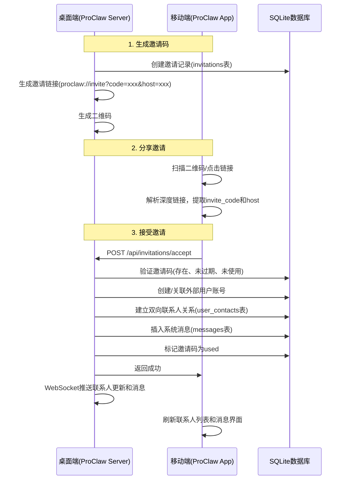

## 需求文档：ProClaw 外部伙伴邀请与自动关联机制（PRD v4.2）开发计划

### 用户需求

实现 ProClaw 外部伙伴邀请与自动关联机制，核心功能：

- 桌面端用户（老板、采购、销售）可生成邀请码/二维码，分享给尚未安装 ProClaw 的外部伙伴（客户、供应商）
- 外部伙伴通过扫码或点击链接下载 App，注册登录后自动与邀请方建立联系人关系
- 自动推送预设的业务消息（订单卡片、价格更新通知等）
- 邀请安全可控：时效性（默认7天）、一次性使用、可选手机号绑定
- 兼容现有网络模式（局域网直连、Tailscale、云中继）

### 产品概述

- **核心功能1**：桌面端生成邀请码/二维码（订单分享、价格更新通知）
- **核心功能2**：移动端深度链接解析与邀请接受流程
- **核心功能3**：自动建立双向联系人关系并推送业务消息
- **核心功能4**：邀请管理（查看、撤销）

### 视觉效果

- 桌面端：订单详情页和商品管理页新增"分享"按钮，点击弹出模态框显示二维码和分享链接
- 桌面端：设置页新增"邀请管理"入口，展示邀请记录列表（状态、时间、关联业务）
- 移动端：首次启动自动检测待处理邀请码，提示用户接受；联系人列表自动展示新建立的联系人分组

## 技术栈选型

- **后端**：Rust + Axum（现有架构），SQLite（桌面端本地数据库）
- **前端桌面端**：React + TypeScript + MUI（现有架构）
- **前端移动端**：React Native + TypeScript（现有架构）
- **实时通信**：WebSocket（现有 `WebSocketManager`）
- **深度链接**：React Native `Linking` API（内置）

## 实现方案

### 数据库层

新增两张表（参考 PRD 3.3 节和现有 `src/db/schema.sql` 风格）：

**invitations 表**：存储邀请码信息，关联邀请类型、业务对象、发起人、有效期等

- 字段：`id`, `invite_code` (UNIQUE), `inviter_id` (REFERENCES users(id)), `target_phone`, `type` (CHECK 'order_share'|'price_update'), `business_ref_id`, `status` (CHECK 'active'|'used'|'expired'|'revoked'), `expires_at` (INTEGER Unix时间戳), `created_at`, `used_at`, `used_by`
- 索引：`idx_invitations_code ON invitations(invite_code)`, `idx_invitations_status ON invitations(status)`

**user_contacts 表**：存储用户联系人关系（双向）

- 字段：`id`, `user_id` (REFERENCES users(id)), `contact_id` (REFERENCES users(id)), `contact_type` (CHECK 'supplier'|'customer'|'colleague'), `created_at`
- 约束：`UNIQUE(user_id, contact_id)`
- 索引：`idx_user_contacts_user ON user_contacts(user_id)`, `idx_user_contacts_contact ON user_contacts(contact_id)`

现有 `users` 表已支持 `user_type='external'` 和 `external_type` 字段，无需修改。
现有 `messages` 表已支持 `content_type` 字段（含 `'order_card'`），可直接使用。

### 后端 API 层

参考现有 `users.rs` 实现模式（使用 `axum::extract::State`, `Json`, `Path`, `Query` 等 extractor，使用 `rusqlite::params!` 进行参数化查询，使用 `serde::Deserialize` 定义请求结构体）。

新增 `src-tauri/src/api/invitations.rs` 文件，实现：

1. `create_invitation()` — `POST /api/invitations/create`，生成邀请码，权限检查（`manage_purchase` 或 `create_sales_order`）
2. `accept_invitation()` — `POST /api/invitations/accept`，接受邀请（无需预先认证，添加 IP 限流防滥用）
3. `revoke_invitation()` — `POST /api/invitations/:code/revoke`，撤销邀请
4. `list_invitations()` — `GET /api/invitations`，查询邀请记录

路由注册在 `src-tauri/src/api/mod.rs` 的 `create_router()` 函数中新增。

**接受邀请接口认证绕过方案**：将 `accept` 端点放在单独的公公开路由组中，在函数内部实现 IP 限流（基于 `std::collections::HashMap<String, (u32, Instant)>` 内存限流，同一 IP 每分钟最多5次）。

### 前端桌面端层

- 新建 `src/components/Invitation/InvitationDialog.tsx`，使用 MUI `Dialog` 组件显示二维码和分享链接
- 新建 `src/lib/invitationService.ts`，封装邀请 API 调用（参考现有 `purchaseService.ts` 模式，使用 `invoke` 调用后端 Tauri 命令）
- 修改 `src/pages/PurchasePage.tsx`，在订单详情区域新增"分享给供应商"按钮
- 修改 `src/pages/ProductsPage.tsx`，在商品价格更新后新增"通知客户价格更新"按钮
- 新建 `src/pages/InvitationManagementPage.tsx`，实现邀请管理页面（表格展示、筛选、撤销）
- 修改 `src/pages/SettingsPage.tsx`，新增"邀请管理"Tab 或菜单项

### 移动端层

- 修改 `mobile/App.tsx`，使用 `Linking.getInitialURL()` 和 `Linking.addEventListener('url', callback)` 监听深度链接
- 新建 `mobile/src/services/InvitationService.ts`，封装邀请 API 调用（参考现有 `ApiService.ts` 模式）
- 新建 `mobile/src/screens/InvitationHandlerScreen.tsx`，实现邀请处理屏幕（显示邀请信息、接受/拒绝按钮）
- 修改 `mobile/src/screens/ContactsScreen.tsx`，展示新增的联系人分组
- 新建 `mobile/src/components/OrderCardMessage.tsx`，实现订单卡片消息组件

### WebSocket 层

修改 `src-tauri/src/api/websocket.rs`，在 `WsResponse` 结构中新增 `invitation_accepted` 和 `contact_update` 消息类型，在邀请被接受时推送给邀请方。

## 实施细节

### 性能考虑

- 邀请码查询使用 `invite_code` 索引，O(log n) 查询
- `user_contacts` 表使用 `(user_id, contact_id)` 唯一约束，防止重复插入
- WebSocket 推送使用现有的 `DashMap` 存储连接，O(1) 查找

### 安全考虑

- 邀请码使用 UUID v4，熵足够，不可猜测
- 接受邀请接口添加 IP 限流，防止滥发
- `target_phone` 校验防止冒用。
- 邀请码不包含业务敏感信息，仅作为数据库引用

### 兼容性

- 现有 `users` 表已支持 `user_type='external'` 和 `external_type`，无需修改
- 现有 `messages` 表已支持 `content_type` 字段，可直接使用
- 现有 WebSocket 推送机制可直接复用

## 架构设计

### 系统架构图



## 目录结构

```
ProClaw/
├── src-tauri/src/
│   ├── api/
│   │   ├── mod.rs                          [修改] 新增邀请路由注册
│   │   ├── invitations.rs                  [新增] 邀请API处理器
│   │   └── websocket.rs                   [修改] 新增邀请相关WebSocket消息类型
│   └── auth/
│       └── permissions.rs                  [修改] 新增邀请相关权限常量
├── src/
│   ├── db/
│   │   └── schema.sql                      [修改] 新增invitations和user_contacts表
│   ├── pages/
│   │   ├── PurchasePage.tsx                [修改] 新增"分享给供应商"按钮
│   │   ├── ProductsPage.tsx                [修改] 新增"通知客户价格更新"按钮
│   │   ├── SettingsPage.tsx                [修改] 新增"邀请管理"菜单项
│   │   └── InvitationManagementPage.tsx    [新增] 邀请管理页面
│   ├── components/
│   │   └── Invitation/
│   │       └── InvitationDialog.tsx        [新增] 邀请二维码弹窗组件
│   └── lib/
│       └── invitationService.ts            [新增] 邀请API调用服务
├── mobile/
│   ├── App.tsx                             [修改] 新增深度链接监听
│   └── src/
│       ├── screens/
│       │   ├── InvitationHandlerScreen.tsx [新增] 邀请处理屏幕
│       │   └── ContactsScreen.tsx          [修改] 展示新增的联系人分组
│       ├── components/
│       │   └── OrderCardMessage.tsx        [新增] 订单卡片消息组件
│       └── services/
│           └── InvitationService.ts        [新增] 邀请API调用服务
└── database/
    └── migrations/
        └── 005_add_invitations.sql         [新增] 数据库迁移脚本
```

## 关键代码结构

### 后端 Rust 接口（invitations.rs）

```rust
/// 创建邀请请求
#[derive(Debug, Deserialize)]
pub struct CreateInvitationRequest {
    pub invitation_type: String,  // "order_share" | "price_update"
    pub business_ref_id: String,  // 订单号或商品ID列表(JSON)
    pub target_phone: Option<String>,
}

/// 接受邀请请求
#[derive(Debug, Deserialize)]
pub struct AcceptInvitationRequest {
    pub invite_code: String,
    pub new_user: NewUserInfo,
}

#[derive(Debug, Deserialize)]
pub struct NewUserInfo {
    pub phone: Option<String>,
    pub name: String,
    pub password: Option<String>,
}
```

## 设计风格

采用现代化商务风格，结合 ProClaw 现有的紫色主题（#6366f1）进行设计。整体视觉保持专业、清晰、易用。

## 界面设计要点

### 桌面端

**1. 邀请二维码弹窗（InvitationDialog）**

- 弹窗中央显示动态生成的二维码（使用 qrcode.react 或类似库）
- 下方显示分享链接（可复制）
- 显示邀请类型标签（订单分享/价格更新）
- 显示过期时间倒计时
- 底部显示"取消"和"复制链接"按钮

**2. 邀请管理页面（InvitationManagementPage）**

- 顶部显示页面标题和描述
- 表格展示邀请记录：邀请码（脱敏显示）、类型、关联业务、状态（用 Chip 组件显示不同颜色）、创建时间、过期时间
- 支持按状态筛选（全部、活跃、已使用、已过期、已撤销）
- 每行操作列显示"撤销"按钮（仅活跃状态可撤销）
- 使用 MUI `Table`、`TableContainer`、`TableHead`、`TableBody`、`TableRow`、`TableCell`、`Chip`、`IconButton` 组件

**3. 设置页面（SettingsPage）**

- 在现有 Tab 列表中新增"📧 邀请管理"Tab
- 点击跳转到邀请管理页面

**4. 采购订单详情页（PurchasePage）**

- 在订单详情操作区域新增"分享给供应商"按钮（使用 `Share` 图标）
- 按钮样式与现有按钮保持一致

**5. 商品管理页（ProductsPage）**

- 在商品价格更新操作后新增"通知客户价格更新"按钮
- 点击按钮弹出对话框，可选择客户或输入手机号，然后生成邀请

### 移动端

**1. 邀请处理屏幕（InvitationHandlerScreen）**

- 顶部显示 ProClaw Logo 和欢迎语
- 中间显示邀请信息卡片：邀请方名称、邀请类型图标、关联业务摘要
- 底部显示"接受邀请"和"拒绝"两个按钮
- 接受后跳转到主界面，并显示新消息提示

**2. 联系人列表（ContactsScreen）**

- 顶部搜索栏
- 联系人分组：同事、客户、供应商（根据 `contact_type` 分组显示）
- 每个联系人显示头像、名称、公司、职位/部门
- 新增的联系人自动出现在对应分组中

**3. 订单卡片消息（OrderCardMessage）**

- 显示订单号、总金额、状态（用颜色标签显示）
- 点击跳转到订单详情（如果有权限）
- 卡片样式与现有消息气泡保持一致

## Agent Extensions

### Skill

- **code-explorer**：用于深入探索 ProClaw 项目代码结构，了解现有实现模式、文件组织和代码风格，确保新开发的功能与现有架构保持一致。
- 预期结果：获取完整的代码结构信息，包括后端 API 模式、数据库 schema、前端组件结构、移动端架构等，为开发计划提供准确的技术细节。