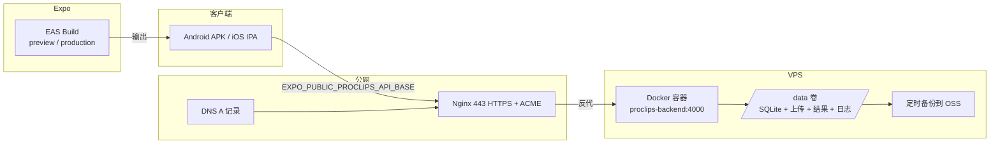
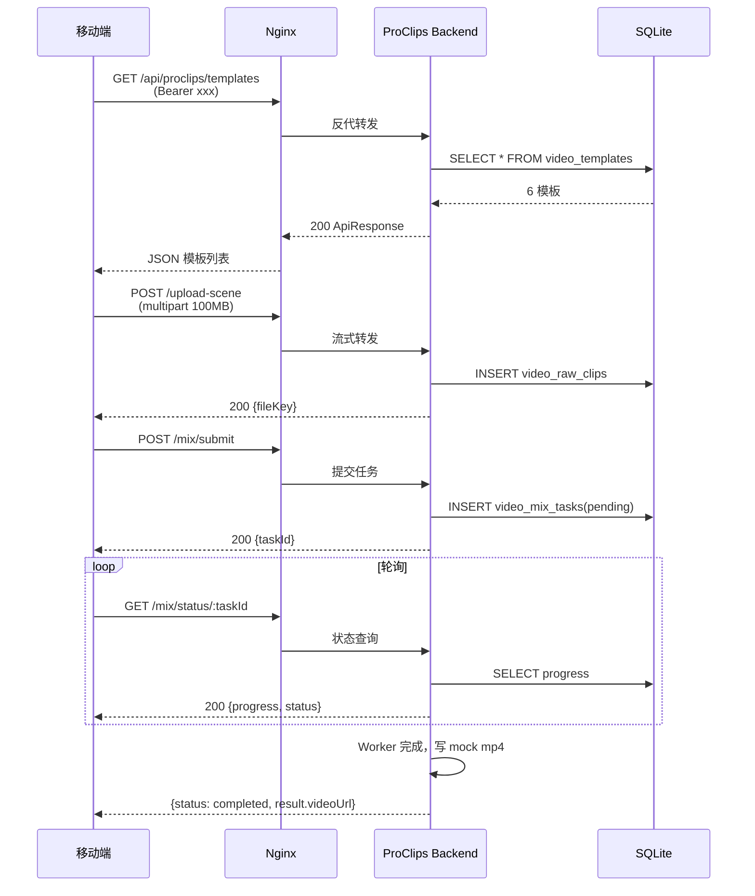

# ProClips 部署 Runbook

> ProClips 子项目（移动端 + 独立后端）的端到端部署操作手册。
> 目标读者：负责发版的同学 + 排障 on-call。
> 范围：V1（Fastify + SQLite + EAS Build）生产环境。

---

## 0. 部署拓扑



---

## 1. 前置条件清单（部署前一次性准备好）

| # | 项 | 说明 |
|---|---|---|
| 1.1 | 公网 VPS | ≥1 核 / 512MB / 10GB，系统 Ubuntu 22.04 LTS |
| 1.2 | 域名 | `api-proclips.example.com`，A 记录解析到 VPS IP |
| 1.3 | Docker + Docker Compose | `docker --version` ≥ 24.x |
| 1.4 | Nginx | 宿主机装 `nginx` + `certbot`（用于反代和证书） |
| 1.5 | EAS 账号 | 项目 owner = `biglionx`，projectId = `09c592c9-01be-4eb0-bf85-25b804ea67e7` |
| 1.6 | Apple Developer | iOS 上架必备（仅 iOS 需要） |
| 1.7 | DeepSeek API Key | 用于 Agent 对话，[这里申请](https://platform.deepseek.com/api_keys) |
| 1.8 | 数据库备份目的地 | OSS / S3 bucket（备份脚本用） |

---

## 2. 后端部署（VPS 侧）

### 2.1 首次部署

```bash
# 1) SSH 到 VPS，把代码拉到部署目录
ssh root@<vps-ip>
mkdir -p /opt/proclips && cd /opt/proclips
git clone https://github.com/biglionx/proclaw.git .
cd ProClips-APP/backend

# 2) 复制并填写 .env
cp .env.example .env
vim .env   # 按需修改以下几项：
           #   NODE_ENV=production
           #   JWT_SECRET=$(openssl rand -base64 48)
           #   PUBLIC_BASE_URL=https://api-proclips.example.com
           #   CORS_ORIGINS=https://app.example.com,https://expo.dev,https://*.expo.dev

# 3) 启动容器（后台）
docker compose up -d --build

# 4) 验证容器健康
docker compose ps
docker compose logs -f proclips-backend   # Ctrl+C 退出
curl -s http://127.0.0.1:4000/health
```

### 2.2 配 Nginx + HTTPS

```bash
# 1) 拷本仓库的反代配置（已生成在 ProClips-APP/backend/nginx.conf）
cp nginx.conf /etc/nginx/sites-available/proclips.conf
sed -i 's/api-proclips.example.com/<你的真实域名>/g' /etc/nginx/sites-available/proclips.conf
ln -sf /etc/nginx/sites-available/proclips.conf /etc/nginx/sites-enabled/proclips.conf
rm -f /etc/nginx/sites-enabled/default

# 2) 申请并自动写入证书
certbot --nginx -d <你的真实域名>

# 3) 检测并热加载
nginx -t && systemctl reload nginx

# 4) 外网验证
curl -sI https://<你的真实域名>/health
# 期望：HTTP/2 200 + HSTS 头
```

### 2.3 部署后自检

```bash
cd /opt/proclips/ProClips-APP/backend
docker compose exec proclips-backend npm run smoke
```

期望输出：`[smoke] done`，每行 ✅。任何一项 ❌ 都先回查 `docker compose logs`。

### 2.4 数据备份（每日 03:00）

```bash
# 写入 crontab：crontab -e
0 3 * * * cd /opt/proclips/ProClips-APP/backend \
  && tar czf /backup/proclips-$(date +\%F).tar.gz data/db.sqlite data/uploads data/results \
  && aws s3 cp /backup/proclips-$(date +\%F).tar.gz s3://<your-bucket>/proclips/ \
  && find /backup -name "proclips-*.tar.gz" -mtime +7 -delete
```

### 2.5 本节所有 curl 命令的 PowerShell 提示

> ⚠️ **Windows PowerShell 用户**：`curl` 在 PowerShell 是 `Invoke-WebRequest` 的别名，不是原生 curl。
> 本节所有 `curl ...` 都请改为 `curl.exe ...`（或使用 `wsl` / Git Bash）。例：
>
> ```powershell
> curl.exe -sI https://<你的真实域名>/health     # ✅ 正确
> curl    -sI https://<你的真实域名>/health     # ❌ 会报“强制参数缺失”
> ```
>
> 同样，`&&` 在 PowerShell 里不是语句分隔符，多步命令请用 `;` 隔开：
>
> ```powershell
> cd ProClips-APP\backend; docker compose up -d --build; npm run smoke   # ✅
> cd ProClips-APP\backend && docker compose up -d --build && npm run smoke  # ❌
> ```

---

## 3. 移动端发布（EAS Build）

### 3.1 一次性准备

```bash
cd apps/proclips-mobile

# 登录 EAS（首次需要）
npx eas login

# 关联项目（首次）
npx eas init --id 09c592c9-01be-4eb0-bf85-25b804ea67e7   # 或 eas init 自动探测
```

### 3.2 配置 EAS Secrets（敏感变量）

```bash
# ProClips 后端 base URL
eas env:create --name EXPO_PUBLIC_PROCLIPS_API_BASE \
               --value https://<你的真实域名> \
               --environment production --visibility secret

# DeepSeek API Key
eas env:create --name EXPO_PUBLIC_AI_API_KEY \
               --value sk-<你的密钥> \
               --environment production --visibility secret

# 验证
eas env:list
```

### 3.3 构建分发

| 场景 | 命令 | 产物 |
|---|---|---|
| 给内测人员装 | `eas build --profile preview` | `.apk`（含 dev client） |
| 上 Google Play | `eas build --profile production` | `.aab` |
| 上 App Store | `eas build --profile production --platform ios` | `.ipa` |
| 提交商店 | `eas submit --platform android/ios` | 自动上传 |

### 3.4 自动提交小贴士

- **Android**：第一次构建时 EAS 会引导生成 keystore.jks 并托管，记得在 [expo.dev](https://expo.dev) 账号里下载一份备份
- **iOS**：需先在 App Store Connect 创建 Bundle ID `com.proclips.app`，并在 EAS 关联 Apple Developer 账号

---

## 4. 端到端联调（发布后必做）



### 4.1 联调清单

- [ ] `https://<真实域名>/health` 返回 200
- [ ] 移动端登录后能拿到 JWT
- [ ] `/api/proclips/templates` 不报 CORS 错误
- [ ] 上传一个 50MB mp4 → 进度条走完 → 拿到 fileKey
- [ ] 提交混剪 → 30s 内 status 变 completed → 能下载到 mp4
- [ ] 切换成片公开 → 公开链接可直接点开
- [ ] 关闭 App 重新打开 → 商家视频库能看到刚才的成品

---

## 5. 监控与回滚

### 5.1 必装监控（最小集）

| 监控项 | 工具 | 触发动作 |
|---|---|---|
| 容器存活 | Docker `restart: unless-stopped` + healthcheck | 异常自动重启 |
| 磁盘占用 | `df -h` 每日巡检 | /data > 80% 时扩容或清理 |
| HTTPS 证书过期 | `certbot renew`（已配 systemd 定时） | 到期前 30 天续期 |
| 后端日志 | `docker compose logs -f` 或转发到云日志 | ERROR 级别告警 |
| 反代日志 | `/var/log/nginx/proclips.{access,error}.log` | 5xx > 1% 告警 |

### 5.2 回滚流程

**后端回滚**（代码有 bug）：

```bash
cd /opt/proclips/ProClips-APP/backend
git log --oneline -5
git checkout <上一个稳定版本>
docker compose up -d --build
docker compose exec proclips-backend npm run smoke
```

**数据库回滚**（schema 不兼容）：

```bash
# 1) 停服
docker compose stop proclips-backend

# 2) 还原昨天的备份
cp /backup/proclips-<昨天>.tar.gz /tmp/
tar xzf /tmp/proclips-<昨天>.tar.gz -C .

# 3) 起服
docker compose up -d
```

**移动端回滚**：

- Google Play：上传新版 → 用 staged rollout，先给 10%，观察无异常再 100%
- App Store：紧急情况用 [Phased Release](https://developer.apple.com/help/app-store-connect/manage-builds/release-a-version-on-app-store/phase-rollouts)，或下架重新提交
- 内测：直接 `eas build --profile preview` 重发新包

---

## 6. 故障排查速查

| 现象 | 第一步 | 第二步 |
|---|---|---|
| 移动端 CORS 报错 | 查 `CORS_ORIGINS` 是否含 App 来源 | 查 Nginx 头是否被剥 |
| 上传 502 | `nginx error.log` 是否 client_body_timeout | 调高 `client_max_body_size` |
| 混剪任务卡 pending | 看 `docker logs` Worker 是否有报错 | 查 `MIX_WORKER_INTERVAL_MS` |
| 分享链接打不开 | 确认 `PUBLIC_BASE_URL` 是 HTTPS | 看 `/static/results/` 路径是否存在 |
| 证书过期 | `certbot certificates` 看剩余天数 | `certbot renew --force-renewal` |
| 移动端看不到接口 | EAS Secrets 是否设到正确 environment | `eas env:list` 核对 |

---

## 7. 变更记录

| 日期 | 变更人 | 变更内容 |
|---|---|---|
| YYYY-MM-DD | <name> | 初版上线 |

> 每次发版请在本表追加一行，注明 commit hash + 关键变更点。