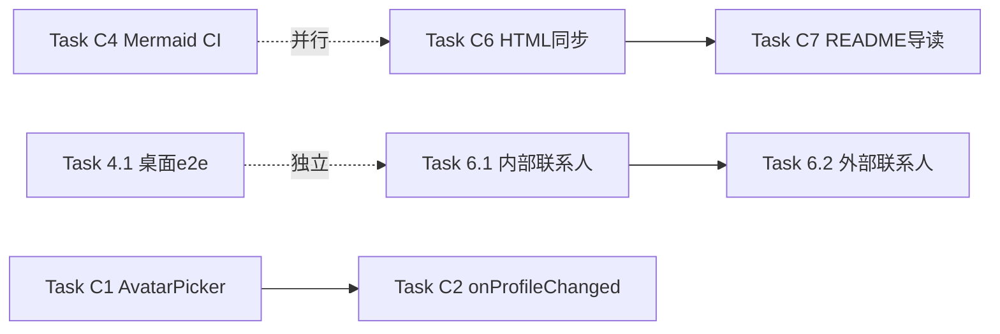

# 联系人资料链 UX 完善 — 开发路线图（调整版）

> **版本**: v1.0
> **日期**: 2026-06-15
> **状态**: 等待数据层方案决策
> **配套文档**:
> - [contact-chat-profile-ux-flow.md](./contact-chat-profile-ux-flow.md)（v1.1 合并 UX 流程图）
> - [contact-chat-profile-ux-flow.html](./contact-chat-profile-ux-flow.html)（可分享 HTML 单页）
> - 原始计划：[联系人资料链_UX_完善开发计划_task-82c.md](file:///C:/Users/Administrator/AppData/Roaming/Qoder/SharedClientCache/cache/plans/)

---

## 一、背景

基于 v1.1 合并 UX 流程图文档，已生成完整开发计划（28 个任务 / 4-6 周）。执行 Sprint 1 / Task 3.1 时发现原计划的**数据层假设与现有架构不符**，本文件记录调整方案。

## 二、现状调研（架构差异）

### 2.1 关键发现

| 计划假设 | 实际现状 | 来源 |
|---------|---------|------|
| `ai_team_groups` 数据库表存在 | **不存在** — [src/db/schema.sql#L376](../src/db/schema.sql#L376) 只有通用 `teams` 表 | schema.sql L376 |
| `AI_TEAM_GROUPS` 存于数据库 | **内存对象** — 由 [src/lib/contactService.ts#L52](../src/lib/contactService.ts#L52) 维护 | contactService.ts L52 |
| Boss 操作 UI 不存在 | **占位 alert 弹窗** — [TeamProfilePage.tsx#L202-L213](../src/pages/TeamProfilePage.tsx#L202-L213) 已有按钮但点击只 alert | TeamProfilePage.tsx L202-L213 |
| Boss 是数据库字段 | **硬编码** — `buildTeamMembers` 函数硬编码 `id: 'self', isBoss: true` ([TeamProfilePage.tsx#L42-L51](../src/pages/TeamProfilePage.tsx#L42-L51)) | TeamProfilePage.tsx L42-L51 |
| AI Team 群组数据来源 | `syncAITeamGroups()` 函数从后端 API 拉取 ([contactService.ts#L145](../src/lib/contactService.ts#L145)) | contactService.ts L145 |

### 2.2 架构图（实际）

```
┌─────────────────────────────────────────────────────────────────┐
│              Backend API (Tauri invoke / Supabase)              │
│         提供 teams 列表 → { id, name, members[] }               │
└────────────────────────────┬────────────────────────────────────┘
                             │ syncAITeamGroups(teams)
                             ▼
┌─────────────────────────────────────────────────────────────────┐
│  AI_TEAM_GROUPS (内存对象)                                      │
│  - Record<string, AITeamGroupConfig>                            │
│  - 由 syncAITeamGroups 动态填充                                 │
│  - Boss 概念硬编码为 'self'                                     │
└────────────────────────────┬────────────────────────────────────┘
                             │ getAITeamGroupConfig(id)
                             ▼
┌─────────────────────────────────────────────────────────────────┐
│  TeamProfilePage.tsx (只读视图)                                 │
│  - 3 个按钮：打开群聊 / 小组设置(alert) / 邀请成员(alert)       │
│  - 3 个 Tab：成员 / 小组描述 / 快捷命令                         │
│  - 无 Boss 管理 UI                                              │
└─────────────────────────────────────────────────────────────────┘
```

## 三、调整方案：数据层选择（二选一）

### 方案 A：纯前端 + localStorage 持久化

| 项 | 内容 |
|---|------|
| 数据层 | localStorage (key: `proclaw:team_overrides`) |
| 状态管理 | Zustand store `useTeamStore` |
| 持久化时机 | Boss 操作成功后立即写入 |
| 适用场景 | 单设备演示 / 原型验证 |
| 优点 | 即刻可做；不动后端；4 天完工 |
| 缺点 | 多端不同步；卸载应用数据丢失 |
| **工时** | **4 天** |

**实现要点**：
- [src/lib/teamOverrideStore.ts](../src/lib/teamOverrideStore.ts)（新建）— Zustand + localStorage
- 覆盖对象：`{ owner_id, status, archived_at, removed_members[] }`
- 启动时从 localStorage 读取，与 AI_TEAM_GROUPS 合并显示

### 方案 B：完整后端 + 数据库 + Tauri Invoke

| 项 | 内容 |
|---|------|
| 数据层 | 新增 SQLite 表 `ai_team_groups` |
| API | 5 个 Tauri invoke（transfer/remove/leave/dissolve/invite） |
| 迁移 | 新增 `database/migrations/2026_06_15_ai_team_ownership.sql` |
| 适用场景 | 正式生产环境；多端同步 |
| 优点 | 真持久化；多端同步；事务保证 |
| 缺点 | 涉及 Rust + 数据库 + invoke + 迁移；7 天完工 |
| **工时** | **7 天** |

**实现要点**：
- [database/migrations/2026_06_15_ai_team_ownership.sql](../database/migrations/2026_06_15_ai_team_ownership.sql)（新建）
- [src-tauri/src/lib/ai_team.rs](../src-tauri/src/lib/ai_team.rs)（新建）— 5 个 #[tauri::command]
- [src/lib/aiTeamApi.ts](../src/lib/aiTeamApi.ts)（新建）— 前端 invoke 包装

### 方案对比矩阵

| 维度 | 方案 A（localStorage） | 方案 B（数据库） |
|------|---------------------|-----------------|
| 完工时间 | 4 天 | 7 天 |
| 多端同步 | ❌ | ✅ |
| 数据可靠性 | 中 | 高 |
| 演示价值 | ⭐⭐⭐ | ⭐⭐⭐ |
| 生产就绪 | ❌ | ✅ |
| 技术债 | 中 | 低 |
| 影响范围 | 仅前端 | 前端 + 后端 + DB |

## 四、立即可执行任务清单（不依赖数据层决策）

以下 8 个任务与 AI_TEAM_GROUPS 持久化无关，**可立即并行推进**：

| ID | 任务 | 文件 | 工时 | 优先级 | 价值 |
|----|------|------|------|--------|------|
| **C6** | HTML 单页自动同步脚本 + pre-commit hook | `scripts/sync-ux-html.mjs`（新建） | 1 天 | P1 | ⭐⭐⭐ |
| **C4** | Mermaid 图 CI 静态检查脚本 | `scripts/check-mermaid.sh`（新建） | 0.5 天 | P2 | ⭐⭐⭐ |
| **C7** | docs/README.md v1.1 文档导读 callout | [docs/README.md](../README.md) | 0.5 天 | P2 | ⭐⭐ |
| **6.1** | 内部联系人头像 → /ucenter | [src/pages/ChatPage.tsx#L466-L484](../src/pages/ChatPage.tsx#L466-L484) | 0.5 天 | P1 | ⭐⭐ |
| **6.2** | 外部联系人 → 客户/供应商详情 | [src/pages/ChatPage.tsx](../src/pages/ChatPage.tsx) | 1 天 | P1 | ⭐⭐ |
| **4.1** | 桌面端 e2e 扩展（D7-D14） | `e2e/contacts-team-members-ext.spec.ts`（新建） | 1.5 天 | P0 | ⭐⭐⭐ |
| **C1** | 移动端 AvatarPicker 30+ 预设对齐 | [mobile/src/components/AvatarPicker.tsx](../mobile/src/components/AvatarPicker.tsx) | 1 天 | P1 | ⭐⭐ |
| **C2** | onProfileChanged 移动端跨屏同步 | [mobile/src/services/agentProfileService.ts](../mobile/src/services/agentProfileService.ts) | 0.5 天 | P1 | ⭐⭐ |
| **合计** | — | — | **6.5 天** | — | — |

### 任务依赖图（不依赖数据层）



### 推荐执行顺序

| 周次 | 任务组合 | 交付里程碑 |
|------|---------|----------|
| **W1 D1-2** | C6 (HTML 同步) + C4 (Mermaid CI) | 文档自动化闭环 |
| **W1 D3** | C7 (README callout) | 文档索引完善 |
| **W1 D4-5** | 6.1 + 6.2 (联系人跳转) | v1.3-A: 联系人跳转完整 |
| **W2 D1-3** | 4.1 (桌面 e2e) | v1.3-B: 18 个 e2e 用例 |
| **W2 D4-5** | C1 + C2 (移动端对齐) | v1.3-C: 移动端完整 |

## 五、待决策事项

### 5.1 数据层方案（A vs B）

需要决策后才能启动：
- Sprint 1 / Task 3.1 数据库迁移
- Sprint 1 / Task 3.2 Tauri Invoke 后端 API
- Sprint 1 / Task 3.3-3.7 TeamProfilePage Boss 操作 UI（依赖 store / API）
- Sprint 1 / Task 3.8 集成验证

### 5.2 决策影响范围

| 决策 | 影响的 Sprint / 任务 |
|------|---------------------|
| 选 A | Sprint 1 全部任务启动；4 天完工 v1.2-A |
| 选 B | Sprint 1 + Sprint 5 启动；7 天完工 v1.2-A |
| 不决策 | 仅推进本文档"四、立即可执行任务清单"的 8 个任务 |

## 六、决策选项（请用户选择）

| 选项 | 描述 | 启动 |
|------|------|------|
| **1** | 立即推进"四"中的 8 个任务（1.5 周），同时并行讨论数据层方案 | 立即 |
| **2** | 先决策数据层方案（A / B），再启动 Sprint 1 | 立即（需回答） |
| **3** | 暂停执行，让我输出调整后的完整计划文档（基于新架构重写 Sprint 1-4） | 立即 |
| **4** | 按原计划继续推进 TeamProfilePage UI（Sprint 1 任务 3.3-3.7），接受 UI 和数据层解耦 | 立即 |

## 七、与原计划对应关系

| 原计划任务 | 调整后状态 | 备注 |
|-----------|----------|------|
| **Sprint 1 / Task 3.1** 数据库迁移 | 🟡 等待方案决策 | 选 B 才需要 |
| **Sprint 1 / Task 3.2** Tauri Invoke | 🟡 等待方案决策 | 选 B 才需要 |
| **Sprint 1 / Task 3.3-3.7** TeamProfilePage UI | 🟡 依赖 store / API | 数据层决策后启动 |
| **Sprint 1 / Task 3.8** 集成验证 | 🟡 依赖 3.1-3.7 | 同上 |
| **Sprint 2 / Task 4.1** 桌面 e2e | ✅ 立即可执行 | 移入"立即可执行清单" |
| **Sprint 2 / Task 4.2** AI Team e2e | 🟡 依赖 Sprint 1 | 数据层决策后启动 |
| **Sprint 2 / Task 4.3** 移动 e2e | 🟡 部分依赖 | 移入"立即可执行"部分 |
| **Sprint 2 / Task 4.4** Playwright 配置 | 🟡 依赖 4.1-4.3 | 同上 |
| **Sprint 3 / Task 5.1-5.5** PRD v13 状态机 | 🔴 全部依赖 | 数据层决策后启动 |
| **Sprint 4 / Task 6.1-6.2** 内/外部联系人跳转 | ✅ 立即可执行 | 移入"立即可执行清单" |
| **Sprint 4 / Task 6.3** 小组活动 Tab | 🟡 部分依赖 | 需要活动日志数据源确认 |
| **Sprint 4 / Task 6.4** 小组管理 Tab | 🟡 依赖 Sprint 1 | 数据层决策后启动 |
| **Sprint 4 / Task 6.5** 营销网站资料 | ✅ 独立 | 可与"立即可执行"并行 |
| **持续 / Task C1-C8** | ✅ 立即可执行（部分） | 见本文档"四" |

✅ 立即可执行（4 个原任务 + 4 个 C 任务 = 8 个）  
🟡 等待决策（11 个任务）  
🔴 强依赖（5 个任务）

## 八、附录

### 8.1 关键文件路径

- 主文档：[docs/features/contact-chat-profile-ux-flow.md](./contact-chat-profile-ux-flow.md)
- HTML 单页：[docs/features/contact-chat-profile-ux-flow.html](./contact-chat-profile-ux-flow.html)
- 桌面端 TeamProfile：[src/pages/TeamProfilePage.tsx](../src/pages/TeamProfilePage.tsx)
- 桌面端 ChatPage：[src/pages/ChatPage.tsx](../src/pages/ChatPage.tsx)
- contactService：[src/lib/contactService.ts](../src/lib/contactService.ts)
- 移动端 ChatDetail：[mobile/src/screens/ChatDetailScreen.tsx](../mobile/src/screens/ChatDetailScreen.tsx)
- 现有 e2e：[e2e/contacts-team-members.spec.ts](../e2e/contacts-team-members.spec.ts)

### 8.2 相关 PRD

- PRD v11.0 桌面端 UI 升级
- PRD v12.0 AI Team 页面 UI 重构
- PRD v13.0 AI Team 状态机扩展（本次计划产出）

### 8.3 文档维护

- 最后更新：2026-06-15
- 维护人：ProClaw 桌面端团队
- 关联决策会议：待安排（数据层 A vs B）
